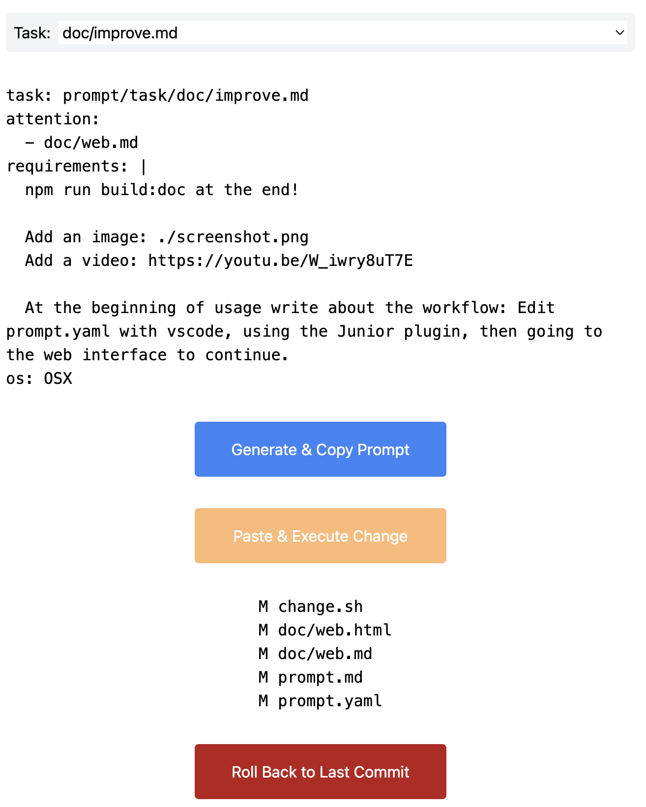

# Web Interface

The Contributor project provides a web interface to guide the AI model. It's designed for use with ChatGPT Pro and doesn't require an API key.

## Starting the Web Interface

Run the application with `npm start` to start a local server on port 3000. Open your web browser and navigate to `http://localhost:3000` to access the web interface.

## Workflow

The typical workflow begins with editing the `prompt.yaml` file in your code editor of choice (we recommend Visual Studio Code with the Junior plugin for an optimal experience). Once you're satisfied with your task setup, you proceed to the web interface for execution and monitoring.

## Usage

The web interface has a few interactive components:

- **Generate & Copy Prompt button (Green)**: Click this to generate a task prompt based on your `prompt.yaml` file and copy it to your clipboard. The copied prompt should be pasted to ChatGPT 4 or similar for execution.

- **Paste & Execute Change button (Orange)**: Paste the response from the AI model (a shell script) into the input field and click this button to execute the changes.

- **Roll Back to Last Commit button (Red)**: If you made a mistake or aren't happy with the changes, click this button to revert to the last commit. Please note, the rollback operation preserves the `prompt.yaml` file, but drops every change since the last commit, including new files created in the meantime, even if they were not created by Junior.

- **Terminal**: Displays the output of your command execution. It's a simple console that shows the progress of the task.

For a more detailed guide on using the web interface, refer to our video tutorial [here](https://youtu.be/W_iwry8uT7E).

Remember, you can always refer to your `prompt.yaml` file to modify the task details or attention mechanism.

Happy developing with your AI contributor!
